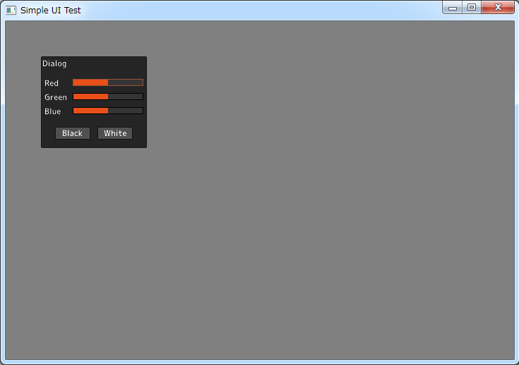

SimpleUI
========

UI implementation by OpenGL
(Headers only implementation)

OpenGL描画によるシンプルなUI実装
ヘッダのインクルードのみで利用可能

# Platform
- Windows(Win32)
- MacOSX(Cocoa)
- Linux(X11)

# License
- MIT License

# Screenshots

